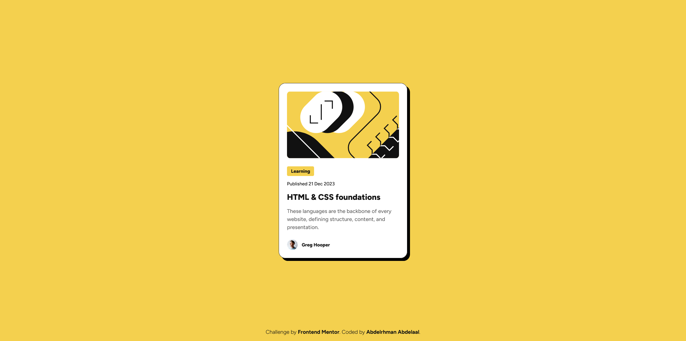

# Frontend Mentor - QR code component solution

This is a solution to the [QR code component challenge on Frontend Mentor](https://www.frontendmentor.io/challenges/qr-code-component-iux_sIO_H). Frontend Mentor challenges help you improve your coding skills by building realistic projects.

## Table of contents

- [Overview](#overview)
  - [Screenshot](#screenshot)
  - [Links](#links)
- [My process](#my-process)
  - [Built with](#built-with)
  - [What I learned](#what-i-learned)
  - [Continued development](#continued-development)
  - [Useful resources](#useful-resources)
- [Author](#author)
- [Acknowledgments](#acknowledgments)

## Overview

### Screenshot

### Links

- Solution URL: [GitHub](https://github.com/MrBlackvanta/qr-code-component-v2)
- Live Site URL: [Netlify](https://vanta-qr-code-component.netlify.app)

## My process

### Built with

- [React](https://react.dev/) 19 and [Vite](https://vite.dev/) 8
- [TypeScript](https://www.typescriptlang.org/) with strict compiler options
- [Tailwind CSS v4](https://tailwindcss.com/) via `@tailwindcss/vite`, design tokens in `@theme`, and custom typography utilities (`text-preset-*`) in `src/index.css`
- [Figtree](https://fonts.google.com/specimen/Figtree) from Google Fonts (preloaded in `index.html`)
- Component layout in `BlogPreviewCard` (`src/components/BlogPreviewCard.tsx`)
- Article graphic as a React SVG module (`IllustrationArticleSVG.tsx` in `src/assets`)
- Avatar photo imported from `src/assets/image-avatar.webp`
- Path imports from `src` as the base URL (`components`, `assets`, etc.)

### What I learned

- Marking up a card with semantic elements (`<section>`, `<figure>`, `<time dateTime>`, `<figcaption>`) for structure and accessibility.
- Extending Tailwind v4 in CSS with `@theme` for challenge colors and `@utility` for repeatable type scales instead of repeating long class strings in JSX.
- Using an SVG as a typed React component for a crisp illustration that bundles with the app.
- Layering layout with CSS Grid (`place-items-center`, `place-content-center`) and viewport height (`h-dvh`) for a centered, full-screen shell around the card.
- Matching the design’s “hard” shadow and border with arbitrary utilities (e.g. offset box shadow) while keeping spacing and radii consistent on the card.

## Author

- UpWork - [Abdelrhman Abdelaal](https://upwork.com/freelancers/~01f0a9479696b61f49)
- Frontend Mentor - [@MrBlackvanta](https://www.frontendmentor.io/profile/MrBlackvanta)
- LinkedIn - [@yourusername](https://www.linkedin.com/in/abdelrhman-vanta/)
